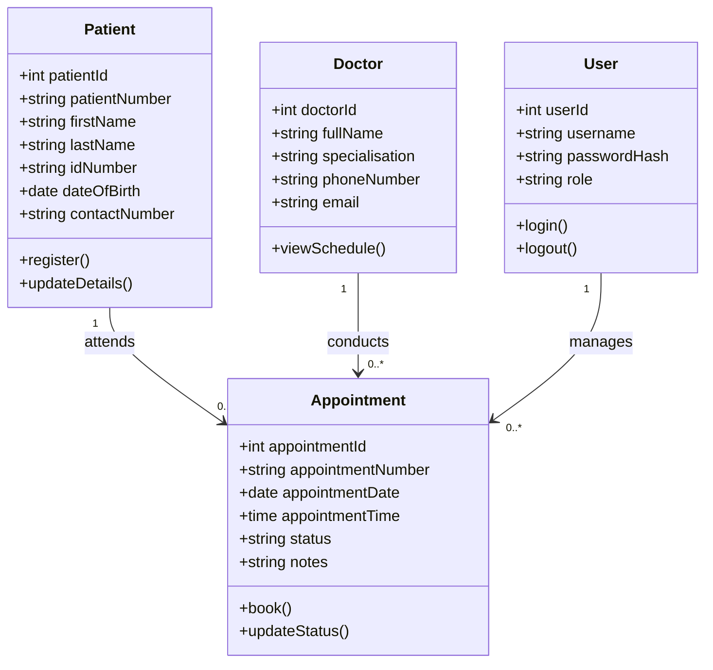

# SmartCare Assessment Documentation

## Section A — Requirements Analysis and Feasibility

### Technical feasibility

The system is technically feasible because Flask, Python, HTML, CSS and SQL support all required features. The clinic needs ordinary networked computers with a modern browser. SQLite provides a reliable demonstration database and can later be migrated to SQL Server. Password hashing, parameterised queries and database constraints are supported by the selected tools. Staff require basic computer training and reliable local network access.

### Operational feasibility

The system replaces slow paper searches with searchable patient records and one appointment list. Receptionists can register and update patients, book appointments, and see doctor availability. The dashboard gives staff immediate totals and upcoming appointments. A short training session, role-based procedures and an initial paper-to-digital capture process will support adoption. A temporary paper fallback should remain during the first deployment week.

### Economic feasibility

Development is affordable because Python, Flask, SQLite, VS Code and supported browsers are free. Existing clinic computers can be reused. Costs include staff training, data capture, backups, hosting and future support. Benefits include less administrative time, fewer misplaced records and double-bookings, faster patient service and improved reporting. These recurring savings make the project economically feasible.

### Legal feasibility

Patient and medical information is personal and special personal information under South Africa's POPIA. SmartCare must collect only necessary data, use it for an authorised healthcare purpose, limit access, protect passwords, keep audit and backup procedures, correct inaccurate records and securely dispose of expired data. Patients should receive a privacy notice. Production deployment must use HTTPS and authorised staff accounts.

### Schedule feasibility

A working minimum viable system can be completed within the three-week assessment period: week 1 for analysis, UML, wireframes and schema; week 2 for coding and integration; week 3 for testing, corrections, screenshots, deployment and documentation. Advanced features can be scheduled after assessment.

### Functional requirements

1. Users must securely log in and log out.
2. Staff must register patients with all mandatory and five additional fields.
3. Staff must search, view and update patient information.
4. The system must store and display doctors.
5. Staff must book an appointment by selecting a patient, doctor, date and time.
6. The system must reject duplicate patient numbers, ID numbers and appointment numbers.
7. The system must prevent a doctor from being booked twice at the same time.
8. Staff must view appointment history and update appointment status.
9. The dashboard must show patient, doctor, appointment and upcoming-appointment totals.

### Non-functional requirements

- Security: hashed passwords, authenticated pages, parameterised queries and HTTPS in production.
- Usability: clear navigation, labelled fields, feedback messages and a responsive interface.
- Performance: routine pages should load within two seconds on the clinic network.
- Reliability: database constraints, validation and daily backups protect data integrity.
- Maintainability: modular templates, external CSS, documented code and automated tests.
- Availability: the system should be available during clinic operating hours with a recovery plan.
- Compatibility: current Chrome, Edge and Firefox versions are supported.

### Recommendation

Proceed with SmartCare in phases. The assessed version meets the clinic's core requirements at low cost and directly addresses missing files, unrecorded appointments and double-bookings. Before production, change the secret key and default password, migrate to managed SQL Server if multiple concurrent sites are required, enable HTTPS, define staff roles, train users and implement encrypted daily backups.

## Section B — Software Design

### UML class diagram

### Wireframe descriptions

- Login: centred SmartCare card, username, password and secure-login button.
- Patient registration: responsive labelled form containing all patient fields, Cancel and Register buttons.
- Appointment booking: appointment number, patient and doctor selectors, date, time, status, notes and Save button.
- Dashboard: left navigation, four statistic cards and an appointment schedule table.

The completed HTML pages are the high-fidelity implementation of these wireframes and can be screenshotted as design evidence.

## Section C — Database Design

The schema is in `schema.sql` and is normalised to third normal form: user, patient, doctor and appointment facts are stored separately. An appointment references exactly one patient and one doctor. Primary keys uniquely identify rows; foreign keys preserve relationships; unique and check constraints enforce data integrity. The Patients table contains six additional fields beyond the minimum: emergency contact phone, blood type, allergies, chronic conditions, preferred language and next-of-kin relationship.

## Section D — System Development

The implemented system contains patient registration and update, secure login/logout, doctor selection, appointment booking, appointment history and status management, dashboard totals, server-side validation, database persistence, responsive HTML templates and external CSS.

## Section E — Testing, Deployment and Maintenance

### Testing evidence

Run `py -m pytest -v` and screenshot the passing results. Automated tests verify invalid and valid login, access protection, patient registration and duplicate rejection. Perform system tests by logging in, registering a patient, booking an appointment, observing the updated dashboard, changing the status and logging out.

### Debugging and corrections

| Problem tested | Correction implemented | Expected result |
|---|---|---|
| Duplicate patient or ID | UNIQUE constraints and handled database error | Friendly rejection message |
| Doctor booked twice | Composite UNIQUE constraint | Second booking rejected |
| Unauthorised dashboard access | Login-required wrapper | Redirect to login |
| Plain-text password risk | Werkzeug password hashing | Only hash stored |
| Missing/invalid patient values | Client and server validation | Record not inserted |

### Deployment

For the assessment, install the requirements and run `py app.py` on the clinic demonstration computer. A production deployment should use a WSGI server, HTTPS, environment variables for secrets, a managed SQL Server database, restricted firewall rules and automated backups.

### Future maintenance

Apply dependency and security updates monthly; review user access quarterly; verify backups daily and test restoration quarterly; monitor errors and database growth; archive records according to clinic policy; repeat tests after every change. Recommended improvements include role-based access, audit trails, SMS reminders, doctor management, reporting exports, patient consent records and multi-clinic support.

